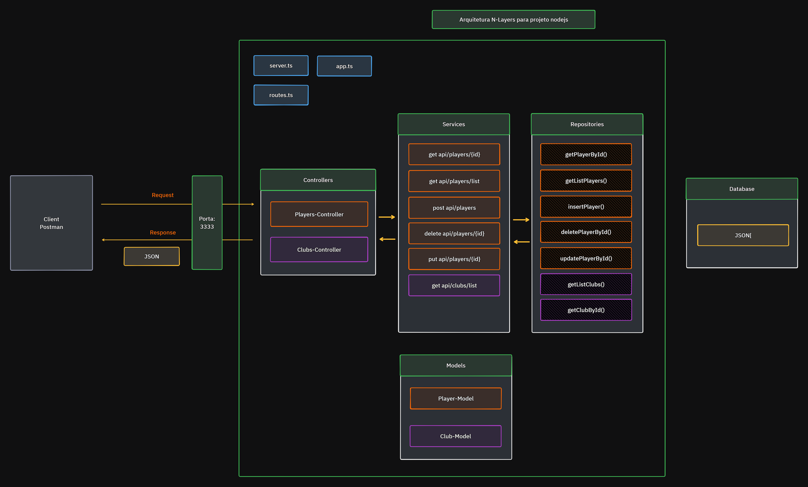

# 🏷️ Projeto Champions League

<hr>

## 📖 Descrição:

O Projeto foi desenvolvido auxiliar desenvolvedores de jogos de futebol, a encontrar com maior facilidade o jogadores com suas estatísticas e os Clubes de futebol.
Podendo Listar todos jogadores ou um jogador, Alterar dados, Deletar jogadores.

O Projeto foi desenvolvido em Nodejs utilizando ExpressJS.

O Destaque desse projeto está na Arquitetura que foi utilizada.

<hr>

## 🚀 Tecnologias:

#### 📦 Dependências de Produção:

[express](https://expressjs.com/): Framework para Node.js que fornece recursos mínimos para construção de servidores web.

[cors](https://www.npmjs.com/package/cors): É um mecanismo que usa cabeçalhos adicionais HTTP para informar a um navegador que permita que um aplicativo Web seja executado em uma origem (domínio) com permissão para acessar recursos selecionados de um servidor em uma origem distinta.

#### 📦 Dependências de Desenvolvimento:

[@types/node](https://www.npmjs.com/package/@types/node): Tipos TypeScript para Node.js, permitindo o uso de tipagem estática e autocompletar.

[tsup](https://www.npmjs.com/package/tsup): Empacotador TypeScript que gera bundles otimizados para produção.

[tsx](https://www.npmjs.com/package/tsx): Ferramenta para execução de arquivos TypeScript diretamente, sem necessidade de compilação prévia.

[typescript](https://www.npmjs.com/package/typescript): Superset de JavaScript que adiciona tipagem estática opcional, ideal para desenvolvimento de grandes aplicações.

[@types/cors](https://www.npmjs.com/package/@types/cors): Este pacote fornece definições de tipos TypeScript para o middleware `cors`.

[@types/express](https://www.npmjs.com/package/@types/express): Este pacote fornece definições de tipos TypeScript para o framework `express`.

<hr>

## 💻 Executando o Projeto:

1. Faça o clone desse repositório na sua pasta:

```sh
git clone https://github.com/RobertoBaiochi/node-ts-express-api-champions-league.git
```

2. Dentro da pasta do projeto, instale as dependências:

```sh
npm install
```

3. Inicie o servidor de desenvolvimento:

```sh
npm run start:dev
```

ou o servidor de desenvolvimento de monitoramento automático:

```sh
npm run start:watch
```

⚠️ _obs: A porta utilizada no servidor é a 3333 e, está localizada no arquivo .ENV na variável PORT._

#### 🔁 Rotas:

**Buscar todos os jogadores:** `GET - http://localhost:3333/api/players`

**Buscar um jogador pelo ID:** `GET - http://localhost:3333/api/players/{ID}`

**Adicionar um jogador:** `POST - http://localhost:3333/api/players`

```json
- BODY - JSON

{
   "id": 9000,
    "name": "Nome do Jogador",
    "club": "Nome do clube do Jogador",
    "nationality": "Nacionalidade do jogador",
    "position": "Posição em que joga",
    "statistics": {
        "overall": 1,
        "pace": 1,
        "shooting": 1,
        "passing": 1,
        "dribbling": 1,
        "defending": 1,
        "physical": 1
    }
}

```

**Deletar um jogador pelo ID:** `DELETE - http://localhost:3333/api/players/{ID}`

**Atualizar o campo `statistic` do jogador pelo ID:** `DELETE - http://localhost:3333/api/players/{ID}`

```json

- BODY - JSON

{
    "overall": 99,
    "pace": 93,
    "shooting": 97,
    "passing": 96,
    "dribbling": 89,
    "defending": 91,
    "physical": 85
}

```

**Buscar todos os clubes:** `GET - http://localhost:3333/api/clubs`

#### ⚡ Scripts:

-   **dist**: Este script utiliza o `tsup` para compilar o código TypeScript localizado na pasta `src`, gerando os arquivos de saída prontos para produção.

    ```json
    "dist": "tsup src"
    ```

-   **start:dev**: Este script executa o servidor em modo de desenvolvimento utilizando o `tsx`, carregando as variáveis de ambiente a partir do arquivo `.env` e executando o arquivo `server.ts` localizado na pasta `src`.

    ```json
    "start:dev": "tsx --env-file=.env src/server.ts"
    ```

-   **start:watch**: Similar ao `start:dev`, este script executa o servidor em modo de desenvolvimento, mas com a funcionalidade adicional de "watch" (observação). Isso significa que o servidor será reiniciado automaticamente sempre que houver alterações nos arquivos. Ele também utiliza o `tsx` e carrega as variáveis de ambiente do arquivo `.env`.

    ```json
    "start:watch": "tsx watch --env-file=.env src/server.ts"
    ```

-   **start:dist**: Este script primeiro executa o script `dist` para compilar o código TypeScript e, em seguida, executa o arquivo de saída gerado (`index.js`) localizado na pasta `dist/src` utilizando o Node.js.

    ```json
    "start:dist": "npm run dist && node dist/src/index.js"
    ```

<hr>

## 📐 Arquitetura

A arquitetura de software utilizada foi a **N Layers**

.
